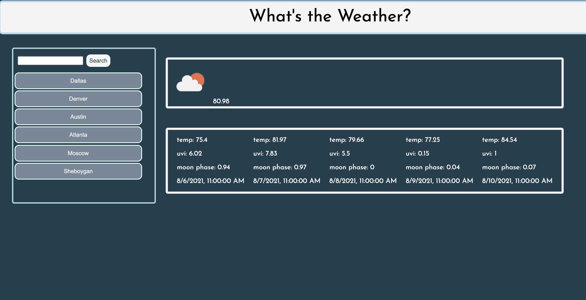

# whats-the-weather 
- What was your motivation? 
This was a fun project to do to begin learning about APIs. 
- Why did you build this project? 
THis is a simple weather app to search any city to find the weather. Several different javascript methods were used to make this work including fetch, .then, local storage, creating elements, and appending elements.
- What problem does it solve? For this project I really got into looking into APIs and learning how to extract data from them and methods used to do so. 
- What did you learn? 
I learned a lot in this homework! While doing this project 

## Here is a preview of my work:

## Here is a link to my work:
[See it here](https://jilliankayworks.github.io/whats-the-weather/)

## Table of Contents 
- [Installation](#installation)
- [Usage](#usage)
- [Credits](#credits)
- [License](#license)
## Installation
web browser
## Usage
simple weather app 
## Credits
DU Bootcamp
Open Weather API 

## License
MIT 

